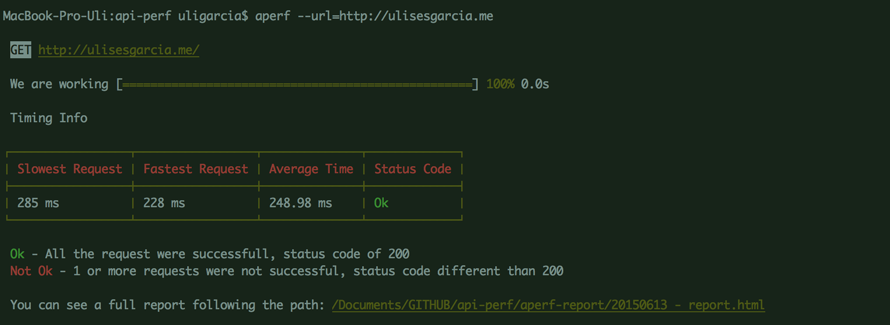

# API-PERF

A module to test the performance of an API or any URL

Installation
=======

    $ npm install api-perf

Examples
=======

Using the CLI
-------
    $ aperf --url=http%3A//www.google.com

You need to escape the URL before: 'http://example.com/test()?query=string&message=hi' to 'http%3A//example.com/test%28%29%3Fquery%3Dstring%26message%3Dhi'. You can do this on your browser console:

    escape('http://example.com/test()?query=string&message=hi');
    "http%3A//example.com/test%28%29%3Fquery%3Dstring%26message%3Dhi"

Using a config.js
-------
**command**

    $ aperf --config=./path/to/file.js

**file.js**

    module.exports = {
	    url:'http://www.google.com'
    }

Options
======

--c
-------
With **--c** you can modify the concurrency of the call, by default the value is 100

    $aperf --url=http://www.google.com --c=100

--i
-------
With **--i** you can modify the amount of  iterations, by default the value is 100

    $aperf --url=http://www.google.com --i=100

--method
-------
With **--method** you can modify the concurrency of the call, by default the value is GET

    $aperf --url=http://www.google.com --method=GET

--proxy
-------
If you are behind a corporate proxy, you can use the command **--proxy** to add it

    $aperf --url=http://www.google.com --proxy=proxy:port

--rname
-------
With **--rname** you can modify the name of the report, by default the value is something like: 'YYYYMMDD - report'

    $aperf --url=http://www.google.com --rname="New Name"

Notes
=======

You can create a config file just adding the commands as arguments of the object, ex:

    module.exports = {
	    url:'http://www.google.com',
	    method:'GET',
	    c:100,
	    i:100,
	    proxy:'proxy:port',
	    rname:'New Name'
    }
